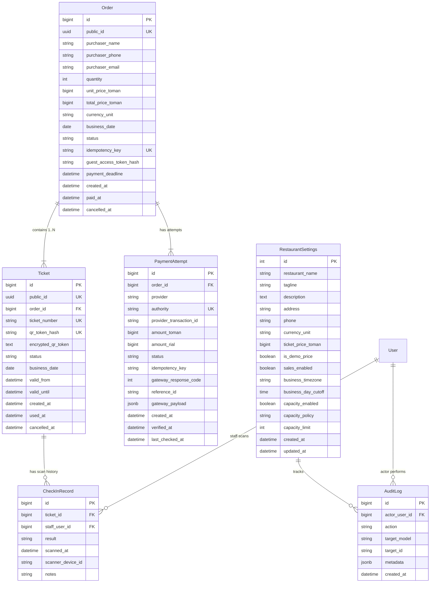

# Entity Relationship Diagram (ERD)

```mermaid
erDiagram
    RestaurantSettings ||--o{ AuditLog : tracks
    Order ||--|{ PaymentAttempt : "has attempts"
    Order ||--|{ Ticket : "contains 1..N"
    Ticket ||--o{ CheckInRecord : "has scan history"
    User ||--o{ CheckInRecord : "staff scans"
    User ||--o{ AuditLog : "actor performs"

    RestaurantSettings {
        int id PK
        string restaurant_name
        string tagline
        text description
        string address
        string phone
        string currency_unit
        bigint ticket_price_toman
        boolean is_demo_price
        boolean sales_enabled
        string business_timezone
        time business_day_cutoff
        boolean capacity_enabled
        string capacity_policy
        int capacity_limit
        datetime created_at
        datetime updated_at
    }

    Order {
        bigint id PK
        uuid public_id UK
        string purchaser_name
        string purchaser_phone
        string purchaser_email
        int quantity
        bigint unit_price_toman
        bigint total_price_toman
        string currency_unit
        date business_date
        string status
        string idempotency_key UK
        string guest_access_token_hash
        datetime payment_deadline
        datetime created_at
        datetime paid_at
        datetime cancelled_at
    }

    PaymentAttempt {
        bigint id PK
        bigint order_id FK
        string provider
        string authority UK
        string provider_transaction_id
        bigint amount_toman
        bigint amount_rial
        string status
        string idempotency_key
        int gateway_response_code
        string reference_id
        jsonb gateway_payload
        datetime created_at
        datetime verified_at
        datetime last_checked_at
    }

    Ticket {
        bigint id PK
        uuid public_id UK
        bigint order_id FK
        string ticket_number UK
        string qr_token_hash UK
        text encrypted_qr_token
        string status
        date business_date
        datetime valid_from
        datetime valid_until
        datetime created_at
        datetime used_at
        datetime cancelled_at
    }

    CheckInRecord {
        bigint id PK
        bigint ticket_id FK
        bigint staff_user_id FK
        string result
        datetime scanned_at
        string scanner_device_id
        string notes
    }

    AuditLog {
        bigint id PK
        bigint actor_user_id FK
        string action
        string target_model
        string target_id
        jsonb metadata
        datetime created_at
    }
```

